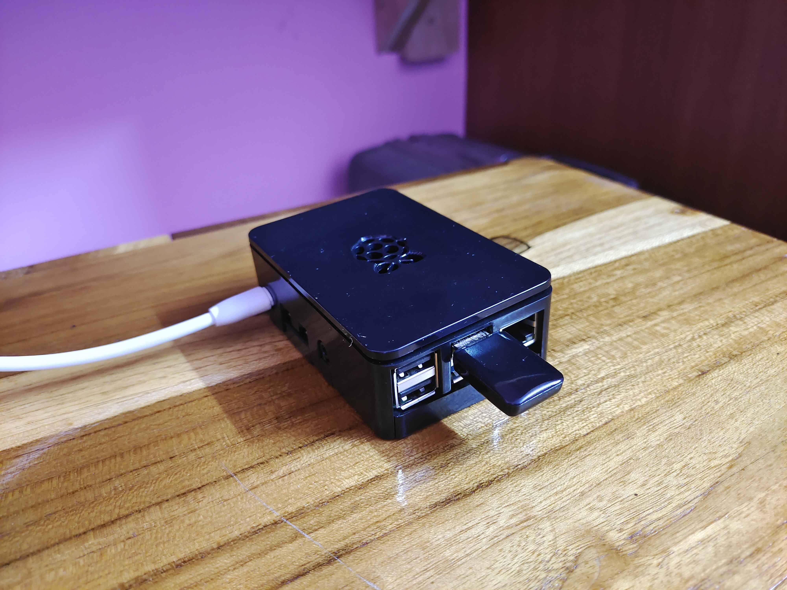

# Smart Router with VPN and Network Monitoring System

### A Raspberry Pi-based Smart Router for Enhanced Network Security, Privacy, and Monitoring

This project transforms a Raspberry Pi into a smart router that extends Wi-Fi range, blocks unsafe domains and ads, secures VPN connections, and monitors network traffic. Additionally, it supports secure file synchronization between devices without using third-party cloud services, making it ideal for personal and small office setups.

## 🌟 Features

1. **Extend Wi-Fi Range**: Use the Raspberry Pi to enhance your existing Wi-Fi network's coverage, eliminating dead spots.
2. **Ad-Blocking**: Block intrusive ads and malicious domains using Pi-hole, speeding up browsing and increasing security.
3. **Packet Tracking**: Track and monitor incoming and outgoing packets for improved network management and security insights.
4. **VPN (Tailscale)**: Mask your IP address and encrypt network traffic for secure browsing with Tailscale VPN.
5. **Firewall**: Built-in firewall for protecting your network from unauthorized access.
6. **File Sync (Syncthing)**: Securely synchronize files between devices without relying on third-party cloud services.
7. **DNS Management**: Control and route DNS queries efficiently using dnsmasq to improve performance and security.

## 🚀 Tech Stack

- **[Grafana](https://grafana.com/)**: Dashboard for visualizing network traffic and monitoring system performance.
- **[Prometheus](https://prometheus.io/)**: Collects and stores metrics for network traffic and system health.
- **[Pi-hole](https://pi-hole.net/)**: Network-wide ad-blocking tool that filters DNS requests and blocks ads, malware, and trackers.
- **[Tailscale](https://tailscale.com/)**: VPN service to securely connect devices and mask your IP address across the network.
- **[hostapd](https://w1.fi/hostapd/)**: Turns your Raspberry Pi into a Wi-Fi hotspot, allowing it to extend network coverage.
- **[dnsmasq](https://thekelleys.org.uk/dnsmasq/doc.html)**: A lightweight DNS and DHCP server that routes DNS queries and caches requests for faster performance.
- **[Syncthing](https://syncthing.net/)**: Securely synchronizes files between devices on your network without external cloud services.

## 📊 Usage

- **Grafana Dashboards**: View real-time statistics on network traffic, packet monitoring, and system performance.
- **Pi-hole Interface**: Monitor blocked domains and adjust the whitelist/blacklist of DNS queries.
- **Tailscale VPN**: Securely access your local network and resources from anywhere in the world.
- **Syncthing**: Synchronize files between devices on your network without the need for cloud storage services.

## 🔧 Network Monitoring & Visualization

This smart router project also includes the ability to monitor and visualize network traffic using **Prometheus** and **Grafana**. With real-time dashboards, you can keep track of incoming/outgoing packets, data flow, and potential anomalies.

## 📜 License

This project is licensed under the MIT License - see the [LICENSE](LICENSE) file for details.

## 🙏 Special Thanks

A special thanks to **[Vivek Sharma](https://github.com/ifsvivek)**   for his invaluable contributions to the project. His input and support were instrumental in the successful development of the Smart Router system.

## 🧑‍💻 Author

**[V Adithya](https://github.com/itsadithyav)**  
**[Patnaikuni Gautam](https://github.com/Patnaikuni-Gautam)** 
